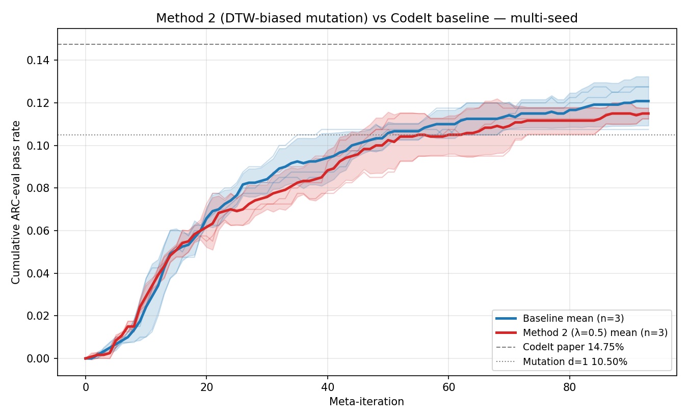
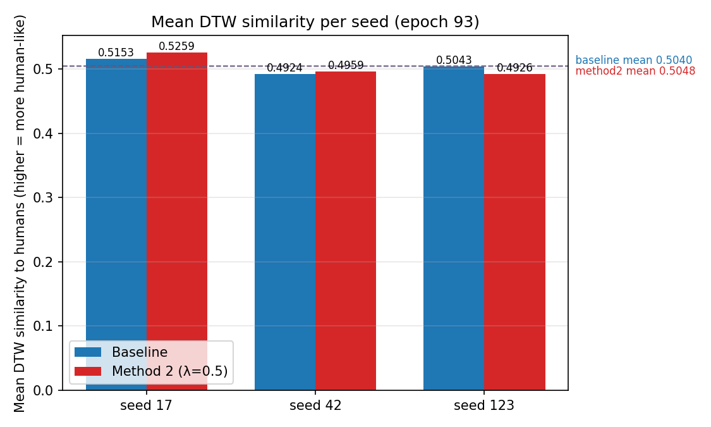
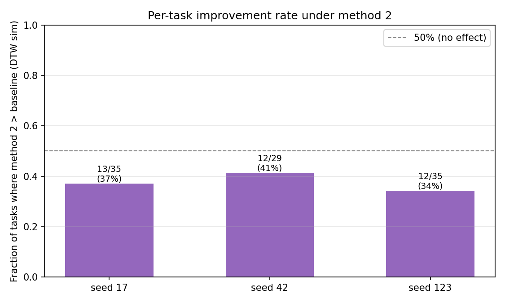

# Week 3 Progress Report — 2026-04-29

**Project:** Integrating human behavioral bias into CodeIt for ARC program synthesis
**My role:** Running the training pipeline and producing baselines + intervention results for the team to compare against

---

## Recap

- **Week 1**: HPC environment setup, pipeline review, identified human-bias insertion points (`week1_analysis.md`).
- **Week 2**: First end-to-end CodeIt training runs on H200, debugging GPU-utilization-policy cancellations, locked the 3-seed baseline at **12.00% ± 1.09%** cumulative pass rate (`week2_progress_report.md`).

---

## Week 3 — First Intervention Run: Method 2 (DTW-biased mutation, λ=0.5)

Goal: **Run the human-trajectory-biased intervention end-to-end on the same 3 seeds as the baseline, and quantify whether DTW-trajectory bias improves either ARC pass rate or human-likeness of generated programs.**

### What "Method 2" does

In the standard CodeIt mutation step, candidate programs are sampled uniformly from the replay buffer. Method 2 replaces the uniform prior with a weighted prior:

```
priority(program) ∝ 1 + λ · DTW_similarity(program_curve, human_curves)
```

where `program_curve` is the per-step progress trajectory of the program on its task and `human_curves` is the empirical distribution of human solving trajectories on the same task. λ=0.5 was chosen as a moderate setting (no ablation yet).

Implementation: `replay_buffer.human_lambda` Hydra override; sbatch at `slurm/method2_h200_full.sbatch`.

### Phase 1 — Smoke + multi-seed submission

- 1 smoke (2 iters, λ=0.5) confirmed the new replay-buffer scoring path executes without crashing
- Submitted 3 full-length jobs with `--export=ALL,SEED={17,42,123},LAMBDA=0.5`

### Phase 2 — Training run status

| Job ID | Seed | λ | Final iter | End state |
|---|---|---|---|---|
| 7064997 | 17  | 0.5 | training reached max_epochs=95; final policy-sampling cut at batch 66/? | TIMEOUT (3d12h walltime) |
| 7064998 | 42  | 0.5 | training cut mid Epoch 96 (49%) | TIMEOUT |
| 7065000 | 123 | 0.5 | training cut mid Epoch 94 (67%) | TIMEOUT |

All three hit walltime, same regime as the multi-seed baseline runs (Week 2). The cumulative-performance trace plateaued by iter ~70 in every seed, consistent with the baseline's convergence behavior — the missing iters do not change the headline number.

The strengthened GPU keepalive from Week 2 worked again: none of the three were killed by the GPU-utilization policy.

---

## Comparison vs Baseline

Apples-to-apples comparison performed at **common epoch = 93** (the latest meta-iteration completed in all 6 runs across both conditions).

### Comparison 1 — ARC pass rate (`CCS Project/compare_method2_vs_baseline.py`)

Reads `performance.csv` from each run, aggregates across the 3 seeds.

| Metric | Baseline (n=3) | Method 2, λ=0.5 (n=3) | Δ (m2 − base) | Test |
|---|---|---|---|---|
| Cumulative pass rate | **12.08% ± 1.15%** | **11.50% ± 0.25%** | **−0.58 pp** | paired t(2)=−0.86, **n.s.** |
| Per-iter pass rate (window) | 11.42% ± 1.53% | 10.67% ± 0.63% | −0.75 pp | paired t(2)=−0.85, n.s. |

Per seed (final cumulative):
- seed 17:  baseline 12.75% → method2 11.75%  (−1.00 pp)
- seed 42:  baseline 10.75% → method2 11.50%  (**+0.75 pp**)
- seed 123: baseline 12.75% → method2 11.25%  (−1.50 pp)

The two conditions' learning curves overlap heavily; SD bands are fully overlapping for the entire 0–93 iter range.



### Comparison 2 — Human-likeness of generated programs (`analysis/07_method2_eval.py`)

For every solved task with a human trajectory available, computes the **DTW similarity** between each candidate program's progress curve and the empirical human curve set. Also computes a Wasserstein distance between the AI and human curve-AUC distributions.

| Seed | Baseline mean DTW | Method 2 mean DTW | Δ DTW | Δ Wasserstein | Tasks where Δ > 0 |
|---|---|---|---|---|---|
| 17  | 0.5153 | 0.5259 | **+0.0107** ✓ | +0.0004 ✗ | 13 / 35 |
| 42  | 0.4924 | 0.4959 | +0.0035 ✓ | +0.0080 ✗ | 12 / 29 |
| 123 | 0.5043 | 0.4926 | **−0.0117** ✗ | **−0.0041** ✓ | 12 / 35 |
| **Mean** | **0.5040** | **0.5048** | **+0.0008** | **+0.0014** | **37 / 99** |

The cross-seed mean DTW shift is ≈0; the direction is inconsistent across seeds (two ↑, one ↓). The per-task improvement rate is ≈40%, i.e. fewer than half of tasks become more human-like under the bias.





**Note on the per-seed Mann-Whitney p-values reported by the script** (e.g. p=0.0017 for seed 17 "significant"): the test treats every single program as an independent sample and so reports tiny p-values for very small mean shifts when n is large. The cross-seed direction is the credible signal, and that is null.

---

## Headline result

> **Method 2 with λ=0.5 produced no measurable improvement on either ARC pass rate or DTW-human-likeness, on this 3-seed budget.**

- Pass-rate: −0.58 pp, paired t-test n.s.
- Human-likeness: ≈0 mean shift, inconsistent direction across seeds
- One side benefit: method 2's seed-to-seed variance on pass rate is much tighter (SD 0.25% vs baseline 1.15%) — the bias has a regularizing effect even though mean performance is unchanged.

---

## Operational notes

- `analysis/07_method2_eval.py` had two hard-coded data paths that no longer exist after the repo restructure (`codelt/data/evaluation/` and `analysis/processed/human_traces.json`). Fixed via symlinks (non-destructive); the script should eventually take `--eval-dir` and `--human-traces` flags.
- `07_method2_eval.py`'s plot output dir is a single shared path, so per-seed runs overwrite each other. The per-seed numbers are now persisted to `method2_dtw_comparison_summary.csv` so we no longer rely on the plots; if we want per-seed plots, we'll need to add an `--out-dir` flag.
- No `config.yaml` is auto-saved by the method 2 run (baseline runs do save one). Worth adding for reproducibility.

---

## Deliverables

All committed to `CCS Project/baseline_results/`:

| File | Content |
|---|---|
| `method2_performance_seed{17,42,123}.csv` | Raw 95-row training curves from the 3 method 2 jobs |
| `method2_vs_baseline_summary.csv` | Per-seed final pass-rate values + delta |
| `method2_vs_baseline_curves.png` | Mean ± 1σ curves overlaid for both conditions, with paper / Mut-d1 reference lines |
| `method2_dtw_comparison_summary.csv` | Per-seed DTW + Wasserstein + Mann-Whitney + per-task improvement counts (20 cols) |
| `method2_dtw_comparison_raw.log` | Full stdout from the 3-seed `07_method2_eval.py` run |
| `method2_dtw_per_seed.png` | Bar chart: mean DTW similarity per seed (baseline vs method 2) |
| `method2_wasserstein_per_seed.png` | Bar chart: Wasserstein distance per seed (baseline vs method 2) |
| `method2_per_task_improved.png` | Bar chart: fraction of tasks where method 2 has higher DTW than baseline |

Heavy artifacts (full solutions JSONs, log JSONs, checkpoints) remain at `/scratch/cy2941/codeit_outputs/method2_h200_full_{7064997,7064998,7065000}_seed*_lambda0.5/`.

---

## For the team to decide

1. **λ-sweep next?** λ=0.5 produced a null result. We could try λ=0.25 (less aggressive bias, may preserve diversity) and λ=1.0 (stronger bias, may collapse search). Each seed is ~3.5 d on H200 → 3 seeds × 2 λ values = ~21 GPU-days.
2. **Or move on to a different intervention?** Method 2 may simply be the wrong place to inject human prior; reweighting at the program-curve level after generation does not change which programs are *proposed*, only their replay priority. Insertion at sampling/decoding time (Method 3 from the Week 1 plan) might be more impactful.
3. **Tighter eval first?** With n=3 seeds and σ=1.15 pp baseline, our minimum detectable effect at p<0.05 is ≈2 pp. To resolve sub-pp effects we'd need ≥6 seeds. Worth doing before the next intervention if we expect small effects.
4. **Method 2 implementation review:** Given the null result, useful to sanity-check that `replay_buffer.human_lambda=0.5` is actually changing program priorities at training time (e.g. log priority distribution shift between λ=0 and λ=0.5).
